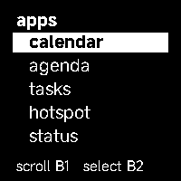
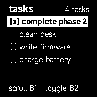
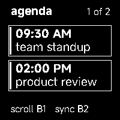
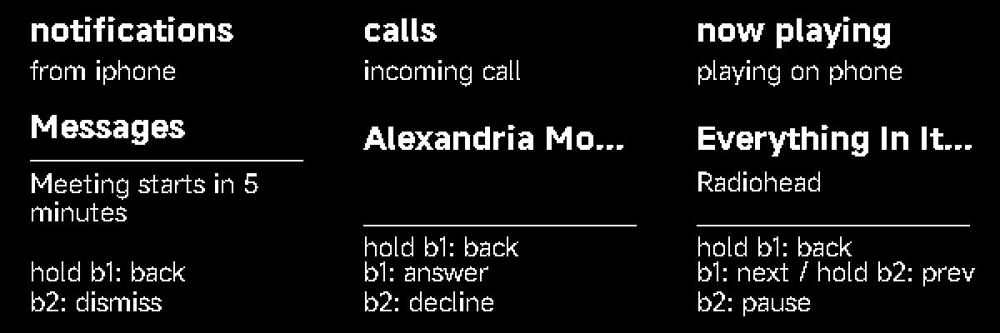

# Ersa Wearable Platform (EWP)

An open-source, modular embedded operating environment and minimalist smartwatch firmware for the **Ampere Works T1E**, inspired by the iconic **Pebble Text Watch** aesthetic.

---

## Visual Showcase

<p align="center">
  
  &nbsp;&nbsp;&nbsp;&nbsp;
  
  &nbsp;&nbsp;&nbsp;&nbsp;
  
  &nbsp;&nbsp;&nbsp;&nbsp;
  
</p>

<p align="center">
  <em>Text Watchface &bull; App Drawer &bull; CalDAV Tasks &bull; CalDAV Agenda</em>
</p>

<p align="center">
  
</p>

<p align="center"><em>Host-rendered 200×200 notification, call, and now-playing screens</em></p>

---

## Ersa Wearable Platform — Layered Architecture

Ersa Wearable Platform is a modular embedded watch environment. Its core event and service interfaces are portable; ESP32 BLE transport and the current screen renderers still depend on their platform libraries:

```text
┌─────────────────────────────────────────────────────────┐
│ Applications                                            │
│   Watchfaces • Calendar • Agenda • Tasks • Status       │
└─────────────────────────────────────────────────────────┘
                            │
┌─────────────────────────────────────────────────────────┐
│ Ersa Application Framework                              │
│   Lifecycle (create/start/resume/pause/stop/destroy)    │
│   Event Subscription • Complications • Canvas UI API    │
└─────────────────────────────────────────────────────────┘
                            │
┌─────────────────────────────────────────────────────────┐
│ Ersa System Services                                    │
│   TimeService • PowerManager (WakeLock RAII)            │
│   NetworkManager (NetworkHandle RAII) • DisplayManager  │
│   StorageService • SettingsService • LoggingService     │
└─────────────────────────────────────────────────────────┘
                            │
┌─────────────────────────────────────────────────────────┐
│ Ersa Platform HAL (Hardware Abstraction Layer)          │
│   IDisplay • IRtc • IBattery • IInput • INetwork        │
└─────────────────────────────────────────────────────────┘
                            │
┌─────────────────────────────────────────────────────────┐
│ Board Support Package (BSP)                             │
│   BoardAmpereT1e (Ampere Works T1E / XIAO ESP32-C3)    │
└─────────────────────────────────────────────────────────┘
```

---

## Key Features

- **Pebble Text Watchface**:
  - Full-bleed black background with pure white typography.
  - Natural time spelled out in English words using Xiaomi's official **MiSans Latin Bold & Light** fonts.
  - Lowercase natural date with ordinal suffix (e.g. `monday` / `september 28th, 2026`).
  - Distraction-free: battery or sync alerts only appear when active or low.
- **Fast, Flicker-Free Partial Refresh**:
  - Panel controller kept energized during user interaction for **~450ms raw partial updates** with zero black/white blinking.
  - Display refresh bug resolved: screen only redraws on minute ticks, button clicks, or state changes.
  - Automatic low-power sleep after 8 seconds of inactivity.
- **Multi-Tier Clock Calibration & NTP Fallbacks**:
  - **Tier 1 (SNTP Pool)**: Multi-server SNTP UDP sync (`pool.ntp.org`, `time.google.com`, `time.cloudflare.com`, `time.apple.com`, `time.nist.gov`).
  - **Tier 2 (HTTP Time Fallback)**: If UDP port 123 is blocked by a cellular phone hotspot or guest Wi-Fi, the watch automatically falls back to HTTP Date header sync (`clients3.google.com`, `worldtimeapi.org`, `cloudflare.com`) over port 80 TCP, guaranteeing accurate time calibration in any network environment.
  - Automatically adjusts the onboard **DS3231 RTC** to exact local time with configurable timezone offsets.
- **Nextcloud & CalDAV Cloud Sync**:
  - **CalDAV Agenda**: Filters events specifically for **today**, supporting standard events and recurring rules (`FREQ=DAILY`, `FREQ=WEEKLY`) with `UNTIL` expiration checking.
  - **CalDAV Tasks**: To-do checklist with instant on-watch toggling (`[ ]` $\leftrightarrow$ `[x]`), prioritizing active/open tasks.
  - **Cache Expiration**: Saved events in NVS are automatically validated against the current day, eliminating stale yesterday events.
- **Centralized String & Fallback Configuration**:
  - All default URLs, server pools, timeouts, preferences namespaces, and UI labels are maintained in `include/ersa/config/system_defaults.h` and `include/ersa/config/ui_strings.h` — zero hardcoded magic literals in application logic.
- **On-Demand Captive Portal Hotspot**:
  - Launch `ErsaWatch-Config` AP from the watch drawer to configure Wi-Fi credentials, CalDAV server, calendar presets (`murena-team`, `personal`, `tasks`), timezone, and time format (12h / 24h).
- **Battery Sensing**:
  - Hardware ADC battery monitoring on GPIO2 (A0) with multi-sample averaging and lithium discharge curve mapping.
- **iPhone ANCS and AMS**:
  - Automatic Apple service discovery after BLE authentication, with separate notification and call queues to handle the initial notification burst.
  - ANCS notification attributes are reassembled across BLE fragments and matched to their notification UID. Added and modified notifications appear in watch history; B2 dismisses the selected alert locally.
  - Incoming calls show caller information when ANCS provides it. B1 sends the available positive action; B2 sends the negative action. ANCS does not provide a complete active-call or dial interface.
  - AMS shows track title, artist, and playback state, and sends supported play/pause and track controls. Call, media, and notification screens share an open monochrome layout.
  - Status reports connection and Apple service readiness. B1 schedules BLE advertising again when disconnected; advertising start is checked and retried after a disconnect.
- **Portable Protocol Decoders**:
  - ANCS and AMS byte decoding is independent of the ESP32 BLE transport. The current `IBluetooth` provider boundary can support future Android or Linux companions; MPRIS and Android support are not included yet.

---

## Hardware Specifications

| Component | Specification | Details |
| :--- | :--- | :--- |
| **Target Board** | Ampere Works T1E | Compact form factor featuring Seeed Studio XIAO ESP32-C3 |
| **MCU** | ESP32-C3 | RISC-V 160 MHz, 320 KB SRAM, 4 MB Flash, Wi-Fi & BLE |
| **Display** | 1.54" E-Paper Display | 200×200 Monochrome (GxEPD2 / SSD1681), partial refresh capable |
| **RTC** | Maxim DS3231 | High-precision I2C RTC (address `0x68`) with backup cell |
| **Buttons** | Dual tactile switches | Upper `B1` = GPIO4 (D2), Lower `B2` = GPIO3 (D1) |
| **Battery** | LiPo sensing | GPIO2 (A0) via voltage divider |

---

## 2-Button Navigation System

```
                  ┌─────────────────┐
                  │ B1 (Upper GPIO4)│ ──> Click: SCROLL (Down / Next)
                  │                 │ ──> Hold:  MENU / EXIT (App Drawer / Clock)
  [Ersa Watch]    ├─────────────────┤
                  │ B2 (Lower GPIO3)│ ──> Click: OK / ACTION (Select / Toggle / Sync)
                  │                 │ ──> Hold:  QUICK SYNC (CalDAV & NTP)
                  └─────────────────┘
```

| Screen | B1 (Click) | B2 (Click) | Hold B1 | Hold B2 |
| :--- | :--- | :--- | :--- | :--- |
| **Watchface** | Open App Drawer | Quick CalDAV Sync | Open App Drawer | Quick CalDAV Sync |
| **App Drawer** | Scroll selection down | Launch selected app | Return to Clock | — |
| **Calendar** | Advance month (`+1 mo`) | Reset to current month | Return to Drawer | — |
| **Agenda** | Scroll event cards | Sync CalDAV events | Return to Drawer | Sync CalDAV |
| **Tasks** | Scroll checklist items | Toggle task (`[x]`) | Return to Drawer | Sync CalDAV |
| **Hotspot** | Refresh status | Start / Stop AP | Return to Drawer | Sync NTP |
| **Status** | Restart BLE advertising when disconnected | Sync NTP Time | Return to Drawer | Sync NTP Time |
| **Notifications** | Next alert | Dismiss selected alert from watch | Return to Clock | Return to Clock |
| **Incoming call** | Answer | Decline | Return to Clock | Decline |
| **Now playing** | Next track | Play / pause | Return to Drawer | Previous track |

Notification dismissal removes the selected alert from the watch's history. ANCS does not provide a general command to remove an arbitrary notification from iOS. Later updates for a locally dismissed UID stay hidden until iOS removes that UID or a new ANCS session begins.

---

## Project Structure

```
Ersa-W1/
├── include/
│   ├── board_pins.h               # Hardware pinout definitions
│   ├── ersa/
│   │   ├── app/                   # Application framework & lifecycle
│   │   ├── board/                 # BSP configurations & interfaces
│   │   ├── config/                # Centralized system defaults & UI strings
│   │   ├── events/                # EventBus & typed Event definitions
│   │   ├── hal/                   # Hardware abstraction interfaces (IDisplay, IRtc, Bluetooth, etc.)
│   │   ├── protocols/             # Portable ANCS and AMS decoding
│   │   ├── services/              # System services (Time, Power, Network, Storage)
│   │   ├── ui/                    # Canvas drawing abstractions
│   │   └── system.h               # System facade
│   └── fonts/
│       └── misans_fonts.h         # MiSans Latin Bold & Light GFX fonts
├── src/
│   ├── apps/
│   │   ├── app_agenda.*           # CalDAV events card viewer
│   │   ├── app_calendar.*         # Interactive monthly calendar
│   │   ├── app_drawer.*           # App launcher with white capsule cursor
│   │   ├── app_portal.*           # Wi-Fi captive configuration portal
│   │   ├── app_status.*           # Hardware diagnostics & battery stats
│   │   ├── app_todo.*             # CalDAV to-do checklist
│   │   └── apps_registry.*        # App registration & EWP bridge
│   ├── bsp/
│   │   └── ampere_t1e/            # Ampere Works T1E board support package
│   ├── core/
│   │   ├── battery.*              # ADC voltage & battery curve calculations
│   │   ├── buttons.*              # OneButton debounce & event dispatcher
│   │   ├── debug_log.*            # USB Serial logging & boot crash records
│   │   ├── net_sync.*             # NTP & HTTP Time sync, CalDAV parser
│   │   ├── watch_clock.*          # DS3231 RTC driver & time caching
│   │   └── watch_config.*         # NVS non-volatile settings storage
│   ├── ersa/                      # Core OS implementation (EventBus, Services, etc.)
│   ├── hal/                       # ESP32 concrete HAL implementations
│   ├── ui/
│   │   ├── watch_icons.*          # Monochrome bitmaps
│   │   └── watch_ui.*             # Display controller & refresh scheduler
│   ├── watchfaces/
│   │   └── watchface_clock.*      # Pebble Text Watch watchface
│   └── main.cpp                   # System boot & execution loop
├── tests/
│   ├── mocks/                     # Mock HAL devices for host unit testing
│   ├── ui_preview/                # Host stubs and 200×200 screen simulation
│   └── main_test.cpp              # Core unit test suites
├── platformio.ini                 # PlatformIO build configuration
├── Makefile                       # Top-level makefile (make firmware / make test)
└── scripts/
    ├── pio.sh                     # Self-contained PlatformIO CLI bootstrap
    └── render_ui_preview.sh       # Adafruit GFX + ImageMagick screen preview
```

---

## Build & Test Workflow

### 1. Run Unit Tests (Host GCC)
Run the host tests:
```bash
make test
```

### 2. Compile Firmware (Target Board)
Compile the production firmware using PlatformIO:
```bash
make firmware
```

### 3. Flash to Device
Connect the Ampere Works T1E via USB-C and upload:
```bash
bash scripts/pio.sh run --target upload
```

### 4. Serial Monitor
```bash
bash scripts/pio.sh device monitor
```

### 5. Simulate UI Screens with ImageMagick

After `make firmware` has installed Adafruit GFX, run this on a host with `g++` and ImageMagick (`magick`):

```bash
./scripts/render_ui_preview.sh
```

The script compiles the production notification, call, and now-playing renderers against Adafruit GFX's 200×200 host canvas. ImageMagick joins and doubles the pixel size for the [preview](docs/images/notification_call_media_simulation.png). It renders simulated notification, caller, and track data; no device or BLE connection is needed. These previews verify layout, while device testing is still needed for button timing and e-paper refresh.

---

## Initial Setup via Wi-Fi Portal

1. On the watch, press **`B1`** to enter the App Drawer, scroll to **`hotspot`**, and press **`B2`** to start the AP.
2. Connect your phone or computer to the Wi-Fi network:
   - **SSID**: `ErsaWatch-Config`
   - **Password**: `12345678`
3. A captive portal page will automatically open (or navigate to `http://192.168.4.1`).
4. Enter your home Wi-Fi credentials, Nextcloud/Murena CalDAV URL, username, and app password.
5. Select **Save & Sync NTP Time**. The watch will connect, calibrate the DS3231 RTC (via SNTP or HTTP Date fallback), download your daily events and tasks, and power down the radio to conserve energy.

---

## Adding Support for New Boards

Ersa Wearable Platform is designed to be hardware-agnostic. To add support for a new board, display, or MCU, see the comprehensive guide:
- 📖 [**Adding Board Support to Ersa Wearable Platform**](docs/ADDING_A_BOARD.md)

---

## License

This project is licensed under the MIT License - see the [LICENSE](LICENSE) file for details. Designed and crafted for the open-source hardware community.
