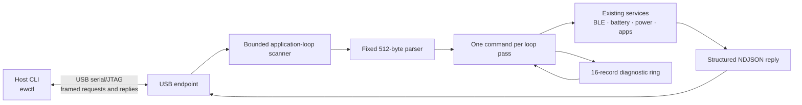

# `ewctl` Device Control Bridge

## Goal

Provide a small, scriptable USB control surface for inspecting and operating an Ersa watch during development. The host tool should feel familiar to someone who has used `adb`, while remaining a narrow Ersa protocol rather than implementing the ADB protocol. It must coexist with normal watch operation: USB commands cannot block the UI loop, BLE callbacks, display work, or power management.

The first transport is the ESP32-C3 USB Serial/JTAG console. Keep the protocol transport-neutral so a later BLE or network transport can reuse command handling with a separate policy.

The host client lives at `scripts/ewctl.py` and uses Python with `pyserial` (`python3 -m pip install -r requirements-ewctl.txt`). Examples: `python3 scripts/ewctl.py status`, `python3 scripts/ewctl.py command battery.read`, `python3 scripts/ewctl.py poll status battery ble power --interval 5`, and `python3 scripts/ewctl.py logs --follow`. Pass `--port /dev/ttyACM0` if auto-detection is ambiguous. The firmware endpoint is implemented in `src/core/usb_control.cpp`; the watch must run a build containing it.

## Architecture



The endpoint is polled from the firmware application loop. It reads at most 64 bytes and dispatches at most one complete request per pass; it does not create a second task or call application code from a USB callback. A fixed 512-byte line buffer bounds memory use. The current handlers are short, read-only service queries; long operations and job polling are not implemented.

The USB transport uses the existing Arduino `Serial` USB Serial/JTAG console. The parser does not depend on a JSON library. Firmware diagnostics are kept in a bounded ring and raw log output is suppressed after the first valid protocol request, preventing log text from corrupting replies.

## Wire protocol

Use newline-delimited JSON (NDJSON) initially. It is easy to inspect with a terminal while remaining straightforward to parse in a host script. Set a strict maximum request and response size (initial proposal: 512 bytes each), reject overlong or malformed frames, and discard input through the next newline after a framing error. Never allocate from an untrusted length field.

Each request includes a protocol version, request ID, command, and optional arguments:

```json
{"v":1,"id":17,"cmd":"battery.read"}
```

A completed command returns exactly one response carrying the same ID:

```json
{"v":1,"id":17,"ok":true,"data":{"millivolts":4126,"percent":97}}
```

Errors are structured and stable for scripts:

```json
{"v":1,"id":17,"ok":false,"error":{"code":"unsupported","message":"Battery telemetry is unavailable"}}
```

The wire format reserves asynchronous job replies for future commands:

```json
{"v":1,"id":18,"ok":true,"job":42,"state":"accepted"}
{"v":1,"event":"job.progress","job":42,"percent":50}
{"v":1,"event":"job.complete","job":42,"ok":true}
```

The current endpoint has no asynchronous jobs or dispatch queue. It processes one request at a time and echoes the request ID. `job.get` returns `unsupported`. Commands must remain idempotent where practical.

## Command model

The implemented command set is read-only:

| Command | Result |
| --- | --- |
| `system.status` | Firmware/build identity, uptime, reset reason, active app, heap, USB session, power state |
| `battery.read` | Latest voltage and estimated percentage, with sample age and validity |
| `ble.status` | Link and advertising state, active companion source IDs, discovered capabilities |
| `power.status` | CPU frequency/PM mode, sleep eligibility/block reason, active power locks |
| `logs.read` | Bounded recent diagnostic records, with cursor for pagination |
| `job.get` | State and result for an asynchronous job |

The first five commands are implemented. `logs.read` returns one record and a `next_cursor`, allowing `ewctl logs --follow` to poll for new records. `job.get` is reserved and currently returns `unsupported`.

Follow-up commands can request `agenda.refresh`, `ble.restart-advertising`, or `system.reboot`. Commands that mutate configuration, clear data, or reboot must be explicitly named and return an acknowledgement before execution. Do not provide an arbitrary shell, memory read/write, or unrestricted register command.

Responses should report capability and validity instead of inventing defaults. For example, if battery sampling is unavailable, return `available:false`; if BLE is disconnected, report connection state while keeping discovered capability data clearly marked stale or unavailable.

## Scheduling, sleep, and USB behavior

- Keep USB receive and transmit handling nonblocking and use fixed-size frame storage.
- Read no more than 64 bytes and dispatch no more than one request per loop pass to preserve UI and BLE responsiveness.
- The existing UI sleep guard blocks automatic light sleep while USB CDC is attached because C3 USB Serial/JTAG loses its connection in light sleep. Detaching USB clears protocol mode; there is no separate inactivity lease yet.
- Do not disable BLE power policy merely because USB is attached. Report the exact sleep blocker in `power.status`.
- USB Serial/JTAG and firmware logs share a physical stream. Diagnostics go to a 16-record in-memory ring and are exposed through `logs.read`. Once a valid request arrives, raw logging is suppressed until USB disconnect so replies remain machine-readable.
- If the host opens or closes the serial port during sleep, recover cleanly. The watch continues its normal boot path and BLE advertising even when no host is present.

## Reliability and validation

The endpoint enforces a 512-byte request bound, required version/ID/command fields, numeric ID parsing, and bounded command names. It discards malformed and oversized lines through the next newline and resumes. Unsupported valid commands receive a structured error. Full JSON schema/depth validation and argument validation must be added before mutating commands are introduced.

The host client has unit tests for request framing, size limits, malformed replies, and argument parsing. Firmware parser/dispatcher host tests and hardware validation remain needed, including attach/detach, command bursts, log cursor polling, BLE activity during a USB session, and sleep after disconnect. Do not claim hardware protocol validation until the firmware endpoint is flashed and exercised on the watch.

## Rollout

1. Implemented: Python host CLI, bounded USB request scanner, versioned NDJSON replies, read-only status handlers, and log-ring polling.
2. Validate the parser independently on host and test attach/detach, command bursts, and sleep behavior on hardware.
3. Add explicit schema validation and an inactivity lease if needed before implementing mutating or asynchronous commands.
4. Keep protocol version negotiation backward-compatible as commands are added.
